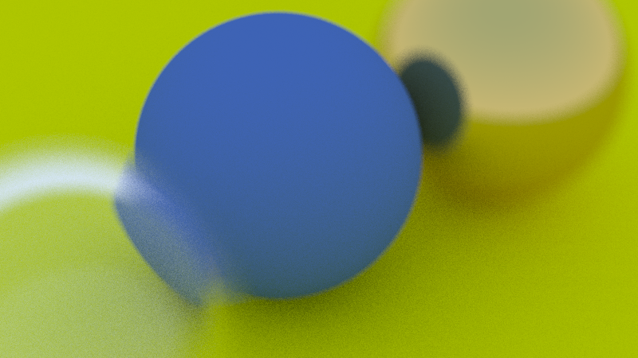

# Ray Tracing

This project is for educational purposes. I'm trying to learn more about C++ and ray tracing. 
Basically, I'm following the book [Ray Tracing in One Weekend](https://raytracing.github.io/books/RayTracingInOneWeekend.html) by Peter Shirley. 
I'm trying to implement the book's code in C++ and add some features to it. 
I think I can learn more fantasy things in this program.

## Perquisites
- C++17
- CMake 3.14

## Installation
```bash
$ git clone git@github.com:ThIsJaCk23657689/RayTracing.git
$ cd RayTracing
$ cmake -S . -B build/Debug -DCMAKE_BUILD_TYPE=Debug -G Ninja
$ cmake --build build/Debug
```

## Current Result


#### Support multi-threading.
Generate a 1920x1080 image with 500 samples per pixel and a depth of 50. It takes about 2 hours and 3 minutes with 16 threads (Intel Core i7-10700).

---
Author: ThIsJaCk